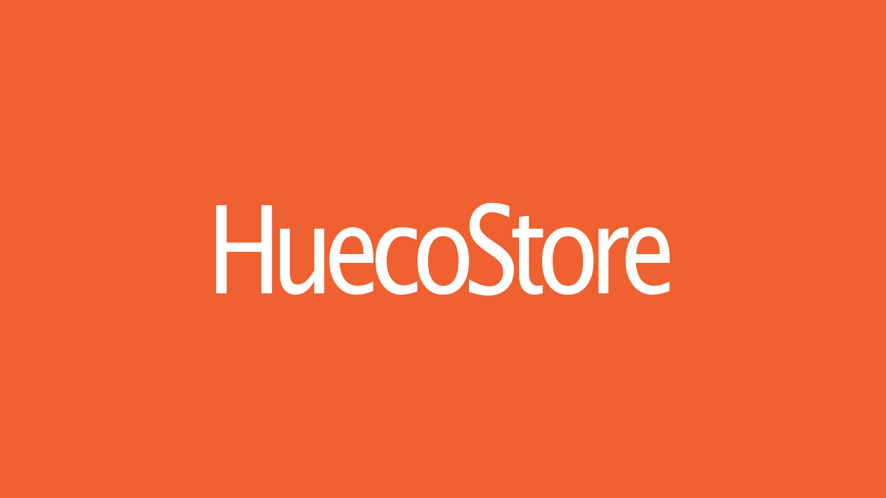
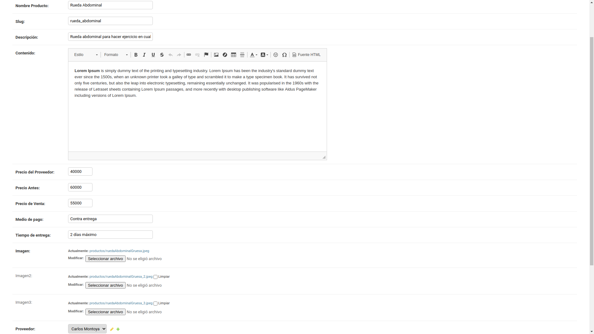
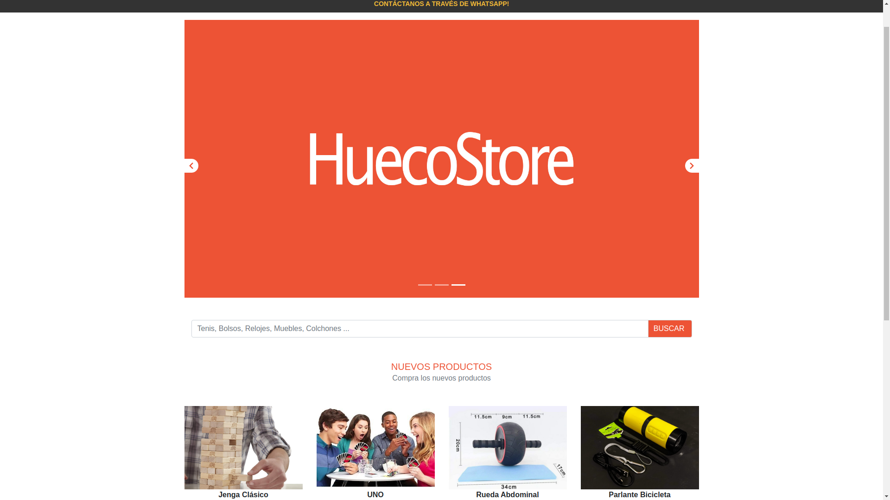
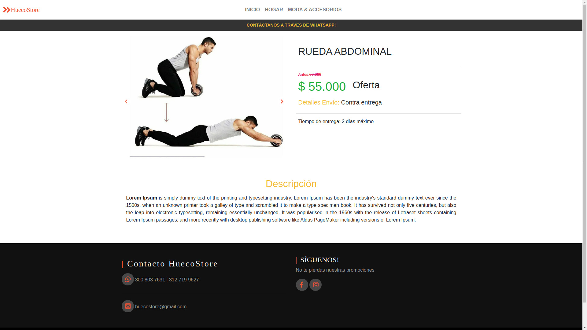

## Table of Content
* [Description](#description)
* [Installation](#installation)
* [How to use](#how-to-use)
* [File Descriptions](#file-descriptions)
* [Authors](#authors)

# Description
Project about an store product section.
- Product section.
- slides to show the main products.
- Products search bar.
- Categories for products.
- Admin options to add products, description, features, new providers, etc.

# Installation

1. Clone this repository `git clone https://github.com/ikki2530/huecostore25.git`
2. Access to huecostore25 `cd huecostore25`
3. Install dependencies `pip install -r requirements.txt`
4. Execute the command `python manage.py makemigrations`
5. Execute `python manage.py migrate`
6. Create the superuser `python manage.py createsuperuser`
7. Finally, run the server `python manage.py runserver`

Note: Before running the project make sure you created the DB.

# How to use

To add a new product go to {yourdomain}/admin login with your superuser and then select [products -> add product] and fill the following form.

The webpage home contains the products.

Product Details: select a product and you can see detailed product information (description, price discounts, shipping details, etc).

## File Descriptions
[requirements.txt](requirements.txt) - The configuration file requirements.txt allows to install the specified packages (Django, gunicorn, pillow, etc) necessary for the development of the website.

[.gitignore](.gitignore) - Specifies intentionally untracked files to ignore.

[manage.py](manage.py) - Script to run administrative tasks

### `apps/` directory with the backend development of the store.

#### `apps/tiendahs/` - Contains the product section development
- [urls.py](apps/tiendahs/urls.py) - This file contains the URL of the app.
- [views.py](apps/tiendahs/views.py) - Contains the views of the products and its categories.
- [models.py](apps/tiendahs/models.py) - Contains the models which allows create the database and its tables.
- [admin.py](apps/tiendahs/admin.py) - register the modules to show them in the admin dashboard.

#### `hueco_store2` - Contain the main settings and urlsof the project

- [settings.py](hueco_store2/settings.py) - contains all the configuration of Django installation. This document explains how settings work and which settings are available.

- [urls.py](hueco_store2/urls.py) - Main project URLS.

#### `media/` - Contain media files uploaded, images in this case.

#### `static/` - Contain the css, some images and javascript files

#### `templates/` - Contains the HTML files for the whole project.

## Authors
* Diego Gomez- [Linkedin](https://www.linkedin.com/in/diegogomez8/) / [Twitter](https://twitter.com/dagomez2530)